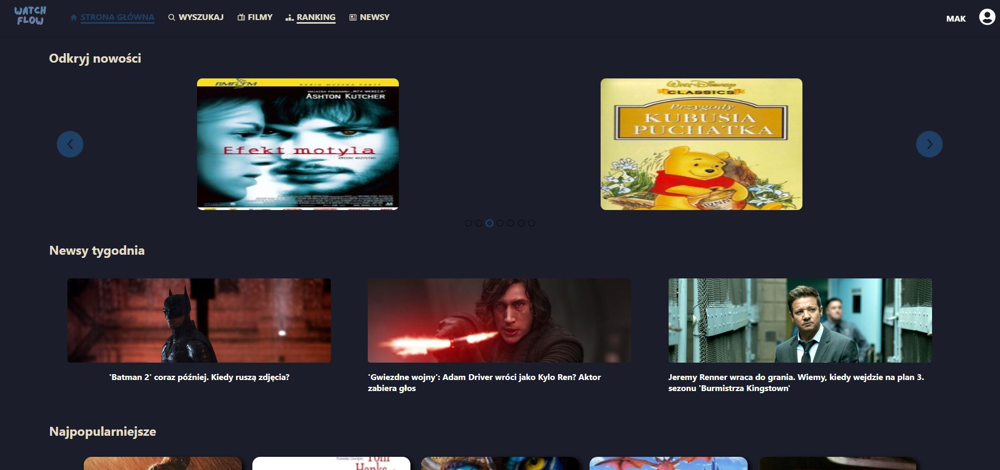
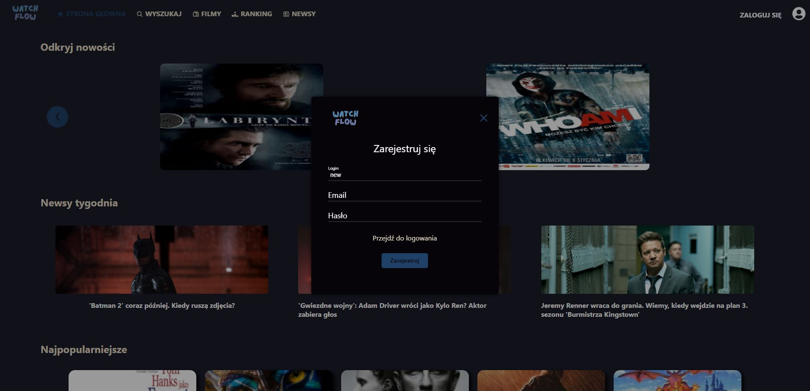
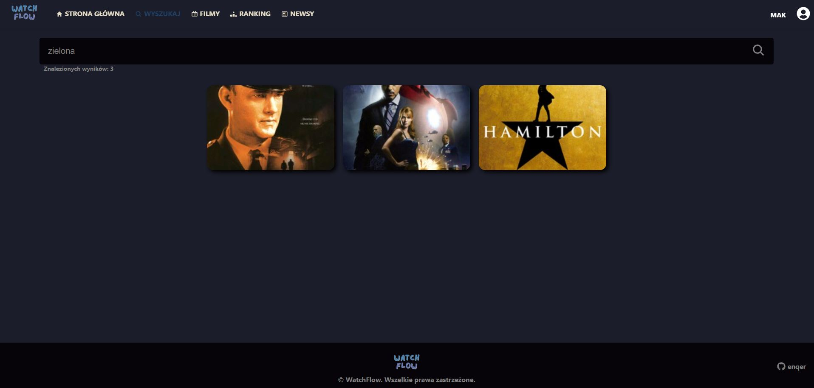
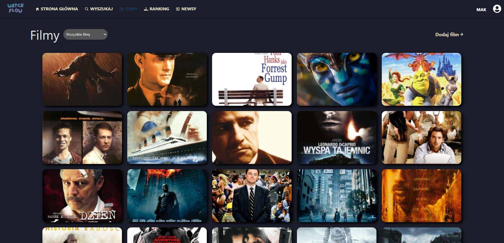
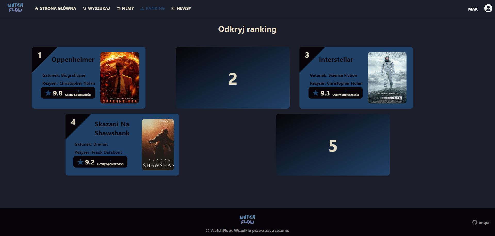
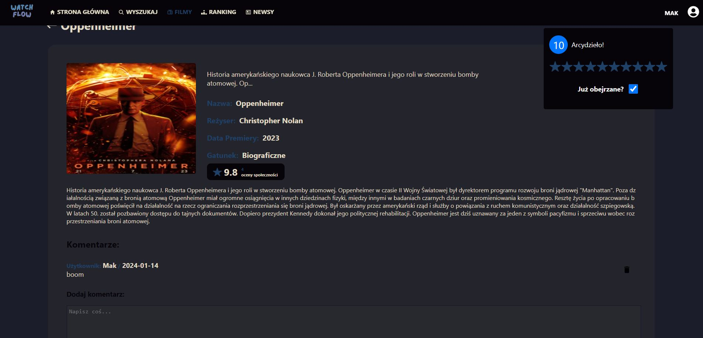
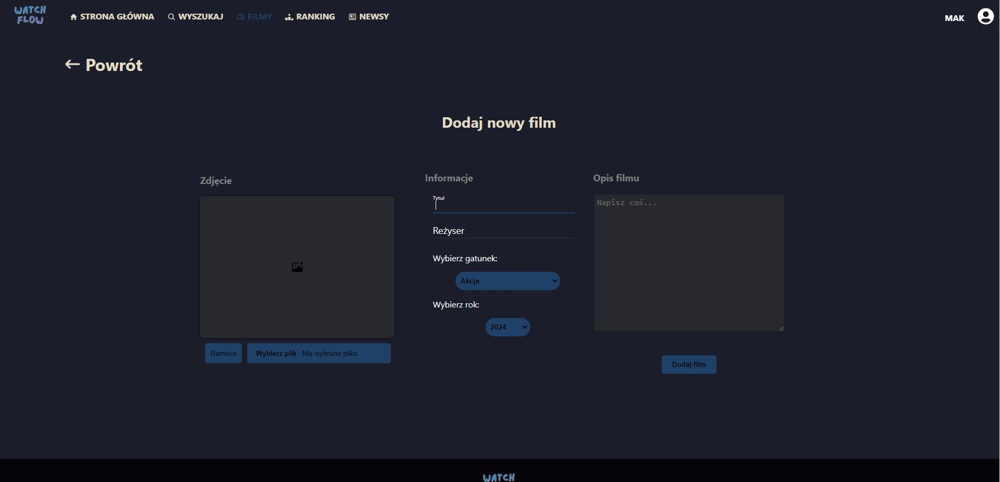
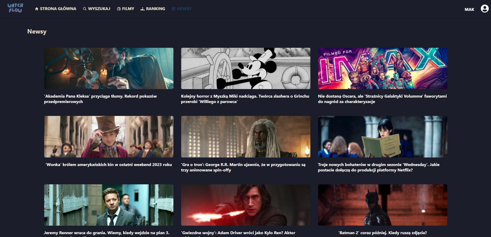
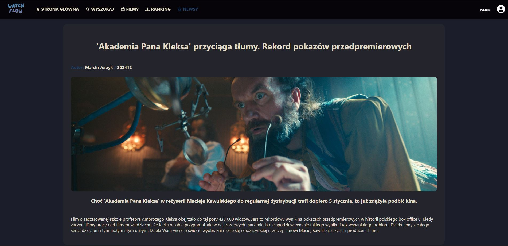

# Watchflow
  

## About project

Watchflow is an application that presents a database of movies. On the site you can find the most interesting and most rated videos by users. Each user has the opportunity to add a new movie and comment on it. In addition, you can read the most interesting news from the world of film.

## How to start

`npm install` 
### then 
`npm start`
### Open http://localhost:3000 in your browser to view the website.

### You have to run backend server from 
https://github.com/enqer/watchflow-backend
### After that you have to set up BASE_URL in appConfig.js to Server URL
`BASE_URL = "http://localhost:8080"`

## Screenshots:

Home Page:

Register Page:

Search Page:

Movies Page:

Ranking Page:

Movie Page:

Adding new movie:

News Page:

Single News Page:

